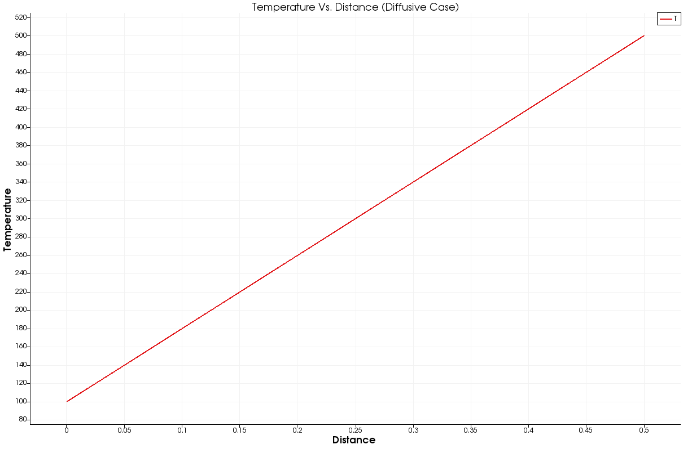
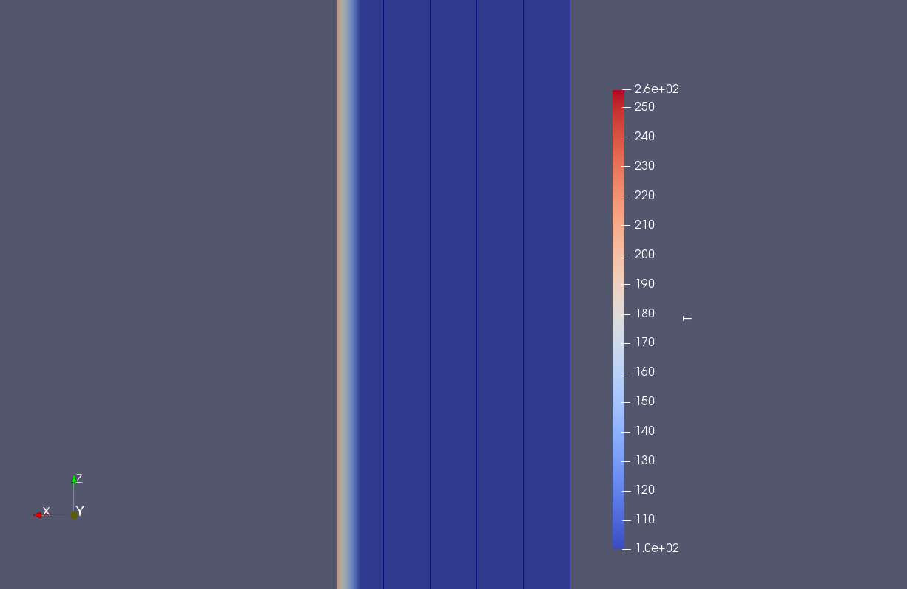
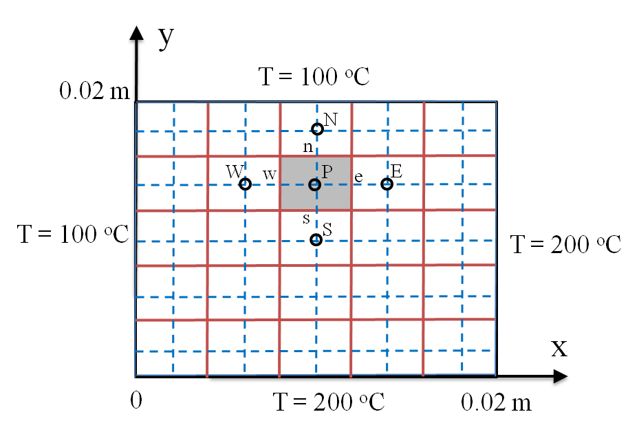
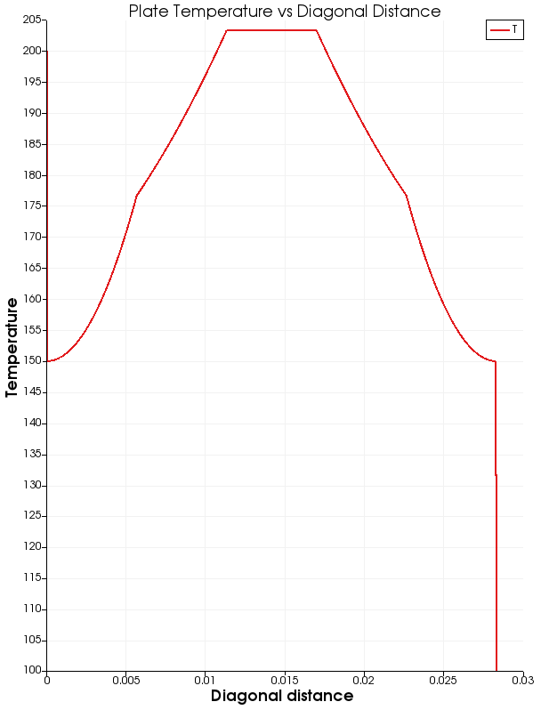

# OpenFOAM_Cases-Diffusion
The below cases were simulated using oepnFOAM. The cases are only concerned with pure diffusion. Each example has a seperate solver.

Variables involved :

\[
{\Gamma} =  Diffusivity
\]
\[
{T} =  Temperature  
\]
\[
{Q} =  Source
\]

## Case of Pure Disffusion :

The below equation describes a state of pure diffusion :

\[
{\Gamma} \frac{\partial^{2} T}{\partial x^2} = 0
\]

Initial State with boundary conditions

Final State
## Case of Pure Disffusion with Source :

The below equation describes a state of pure diffusion with source:

\[
{\Gamma} \frac{\partial^{2} T}{\partial x^2} = Q
\]

Initial State with boundary conditions

Final State

## Case of Pure Disffusion with Source on a PLATE :

The below equation describes a state of pure diffusion with source:
The plate is 2 by 2 cm
\[
{\Gamma} \frac{\partial^{2} T}{\partial x^2} = Q
\]
The problem is as below :

Initial State with boundary conditions

Final State

Plot over Plate Diagonal
